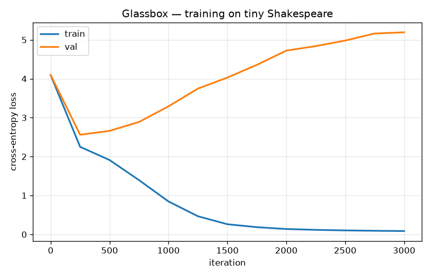

# Glassbox 🔍

[](https://github.com/dylanpatriarchi/glassbox/actions/workflows/ci.yml)
[](LICENSE)

**A decoder-only (GPT-style) transformer implemented from scratch in PyTorch — and heavily annotated so you can *fully understand* it.**

Glassbox is not "a transformer that works." Lots of those exist. Glassbox is a
transformer whose every tensor reshape, every design decision, and every scaling
factor is explained inline, verified by tests, and walked through in this README.
The annotations, the shape comments, the correctness checks, and this walkthrough
**are the product**.

No `nn.Transformer`. No `nn.MultiheadAttention`. Attention is written by hand with
plain matmuls, and there is even a pure-NumPy attention with a **hand-derived
backward pass** verified against numerical gradients — proof that we understand
backprop through attention, not just `loss.backward()`.

> Written independently for teaching. [nanoGPT](https://github.com/karpathy/nanoGPT)
> and [minGPT](https://github.com/karpathy/minGPT) by Andrej Karpathy were an
> inspiration for the minimalist spirit; the code and explanations here are our own.

---

## Table of contents

- [Quickstart](#quickstart)
- [What's inside](#whats-inside)
- [The math of attention (a walkthrough)](#the-math-of-attention-a-walkthrough)
- [A full forward pass, with shapes](#a-full-forward-pass-with-shapes)
- [The design decisions, and why](#the-design-decisions-and-why)
- [Correctness checks (not just "it runs")](#correctness-checks-not-just-it-runs)
- [It actually learns: loss curve & samples](#it-actually-learns-loss-curve--samples)
- [Stretch: attention backward in pure NumPy](#stretch-attention-backward-in-pure-numpy)
- [References](#references)

---

## Quickstart

```bash
# 1. create an environment (Python 3.11+) and install
pip install -e .            # or: uv pip install -e .

# 2. run the correctness tests (this is the fun part)
pytest -q

# 3. train the tiny model on the bundled Shakespeare excerpt,
#    producing assets/loss_curve.png and before/after samples
python scripts/train_demo.py
```

Everything is CPU-friendly and seeded. The demo trains a ~0.8M-parameter model in
a couple of minutes on a laptop.

---

## What's inside

```
glassbox/
├── glassbox/
│   ├── config.py        # GPTConfig: every hyper-parameter + the B/T/C/nh/hs naming key
│   ├── tokenizer.py     # char-level encode/decode — the simplest tokenizer that works
│   ├── data.py          # tiny-Shakespeare loader + a synthetic sorted-copy task
│   ├── attention.py     # scaled dot-product attention + multi-head, BY HAND, shapes annotated
│   ├── model.py         # LayerNorm, MLP, Block (pre-norm), and the full GPT — all by hand
│   ├── sample.py        # autoregressive generation with temperature + top-k
│   └── train.py         # a minimal, readable AdamW training loop
├── from_numpy/
│   └── attention_numpy.py  # attention forward + MANUAL backward in NumPy, gradient-checked
├── tests/
│   ├── test_attention_vs_torch.py  # allclose vs F.scaled_dot_product_attention
│   ├── test_shapes.py              # every shape contract in the model
│   ├── test_overfit.py             # model overfits one batch to ~0 loss (backward is wired)
│   └── test_numpy_backward.py      # hand-derived gradients match finite differences
├── scripts/train_demo.py
└── data/tiny_shakespeare.txt
```

Read the modules in this order: `config → tokenizer → attention → model → sample → train`.

### The shape naming key

Memorise these five letters and every `# (B, T, C) -> (B, nh, T, hs)` comment becomes readable:

| symbol | meaning | in the demo |
|--------|---------|-------------|
| `B`  | batch size (sequences at once) | 32 |
| `T`  | time / block size (sequence length) | 128 |
| `C`  | model width, `n_embd` (a.k.a. `d_model`) | 128 |
| `nh` | number of attention heads | 4 |
| `hs` | head size `= C // nh` (a.k.a. `d_k`) | 32 |

Invariant: **`C == nh * hs`**.

---

## The math of attention (a walkthrough)

Every position emits a **query** ("what am I looking for?"). Every position also
exposes a **key** ("what do I contain?") and a **value** ("what I'll hand over if
you attend to me"). Attention is: score queries against keys, softmax the scores
into weights, and take a weighted average of the values.

For one head with head size `hs = d_k`, given `Q, K, V` each of shape `(T, hs)`:

```
S = Q @ Kᵀ / √d_k        # (T, T)   raw compatibility scores, scaled
P = softmax(S, axis=-1)  # (T, T)   each row is a probability distribution
O = P @ V                # (T, hs)  output = weighted average of values
```

### Why divide by √d_k?

`q·k` is a sum of `d_k` component products. If components are ~unit-variance and
independent, that sum has variance ≈ `d_k`, i.e. standard deviation ≈ `√d_k`. As
`d_k` grows the logits get large, and large logits push **softmax into a
near-one-hot, saturated regime where gradients vanish**. Dividing by `√d_k`
rescales the scores back to ~unit variance and keeps softmax in its
high-gradient region. This is the exact `1/√d_k` from *Attention Is All You Need*.

### The causal mask

This is a language model, so position `t` may only attend to positions `≤ t`
(seeing the future would make next-token prediction trivial). We set
`S[i, j] = -∞` for all `j > i` before the softmax; `softmax(-∞) = 0`, so future
positions receive exactly zero weight. The allowed pattern is lower-triangular:

```
       key→  k0  k1  k2  k3
query q0    [ ✓   ·   ·   · ]     · = -∞ (masked out, becomes 0 after softmax)
      q1    [ ✓   ✓   ·   · ]     ✓ = attend
      q2    [ ✓   ✓   ✓   · ]
      q3    [ ✓   ✓   ✓   ✓ ]
```

### Multi-head, by hand

Rather than one attention over the full width `C`, we split `C` into `nh` heads of
size `hs` and attend `nh` times in parallel — different heads can specialise. The
whole trick is a `view` + `transpose` to expose a `(B, nh, T, hs)` tensor, run the
same scaled-dot-product attention over the `(B, nh)` batch-like dims, then
`transpose` + `view` back to `(B, T, C)`. See `glassbox/attention.py`, where the
shape is annotated at every single step.

---

## A full forward pass, with shapes

Take the demo config: `B=32, T=128, C=128, nh=4, hs=32, vocab=V`.

```
idx                                   (B, T)                    int64 token ids
 │
 ├─ token embedding lookup            (B, T, C)
 ├─ + position embedding (0..T-1)     (B, T, C)   broadcast add
 ▼
x                                     (B, T, C)
 │   for each of n_layer blocks (pre-norm):
 │     x = x + Attn(LayerNorm(x))     (B, T, C)   ── attention mixes ACROSS positions
 │     x = x + MLP (LayerNorm(x))     (B, T, C)   ── MLP processes EACH position
 ▼
final LayerNorm                       (B, T, C)
 ▼
lm_head  (Linear C→V, weight-tied)    (B, T, V)   ── logits: a score per vocab item
 ▼
cross-entropy vs targets              scalar loss  ── predict the next token everywhere
```

Inside one attention:

```
x        (B, T, C)
 → c_attn (Linear C→3C), split        q,k,v each (B, T, C)
 → view + transpose to heads          each (B, nh, T, hs)
 → scaled dot-product attention       (B, nh, T, hs)
 → transpose + view (recombine)       (B, T, C)
 → c_proj (Linear C→C)                (B, T, C)
```

---

## The design decisions, and why

| Decision | What we chose | Why |
|---|---|---|
| **Positional encoding** | **Learned** (a trainable `(block_size, C)` table) | Simplest thing that clearly works; matches the GPT-1/2 lineage. Sinusoidal is parameter-free and extrapolates further, but learned is as good or better *within* the trained context. Cost: positions ≥ `block_size` are undefined (we `assert`). |
| **Norm placement** | **Pre-norm** (`x + Sublayer(LN(x))`) | Keeps a clean residual "highway" for gradients, so deep stacks train easily. Post-norm (the 2017 original) squashes the residual each layer. We add one final `LayerNorm` to tame the growing residual. |
| **Attention** | Fused `c_attn: C→3C` then split | Mathematically identical to three `C→C` projections but one matmul. |
| **Weight tying** | Input embedding **is** the output projection | Both relate token-ids ↔ vectors; sharing saves params and usually improves results (Press & Wolf, 2017). |
| **LayerNorm** | Hand-written | Nothing hidden — you can read the mean/var normalisation. |
| **Residual init** | `c_proj` scaled by `1/√(2·n_layer)` | GPT-2 trick so residual-stream variance doesn't blow up with depth. |
| **Tokenizer** | Char-level | Tiny vocab, zero mystery — you can print the whole `stoi` table. |

---

## Correctness checks (not just "it runs")

`pytest -q` runs four families of checks:

1. **Attention matches PyTorch's reference** — `test_attention_vs_torch.py`
   asserts our by-hand `scaled_dot_product_attention` is `allclose` to
   `torch.nn.functional.scaled_dot_product_attention` for the non-causal, causal,
   and boolean-mask cases. It also verifies the causal mask *actually* hides the
   future (perturbing a future value cannot change an earlier output).
2. **Shape contracts** — `test_shapes.py` asserts every tensor shape the
   annotations promise, checks a fresh model's loss ≈ `ln(vocab)`, and that
   generation extends by exactly `max_new_tokens` even past `block_size`.
3. **It can learn** — `test_overfit.py` overfits one tiny batch to ~0 loss.
   A broken backward path (detached tensor, wrong reshape, mask leaking the
   future) would plateau instead.
4. **Hand-derived gradients are correct** — `test_numpy_backward.py`
   gradient-checks the pure-NumPy attention backward against finite differences.

```
$ pytest -q
.............                                                            [100%]
13 passed
```

---

## It actually learns: loss curve & samples

Training the ~0.8M-param model (`n_layer=4, n_head=4, n_embd=128`, vocab 57) on the
bundled Shakespeare excerpt for 3000 steps:



The training loss drops from **4.09 → 0.086** — the backward path clearly works and
the model is learning. The validation loss *rises* (to ~5.2), which is exactly what
you should expect and is itself the lesson: the bundled corpus is only ~6 KB, so a
0.8M-param model quickly **memorises** it (classic overfitting — train ↓, val ↑).

Is that really a data-size effect and not a broken model? I checked, by running the
**same** config on the full ~1.1 MB tiny-Shakespeare corpus (~170× larger). There the
validation loss **tracks** the training loss all the way down instead of diverging:

| corpus | size | end train | end val | validation over training |
|--------|------|-----------|---------|--------------------------|
| bundled (this repo) | ~6 KB   | **0.086** | ~5.2  | ↑ diverges — the model memorised |
| full tiny-Shakespeare | ~1.1 MB | 1.63    | 1.78  | ↓ 4.21 → 1.78 — tracks train (real generalisation) |

So the machinery generalises once it has enough data; the tiny bundled corpus is
chosen only to keep the demo fast and fully offline. To reproduce the second row,
point `TextData` at any UTF-8 text file of your own — note the argument is an
explicit `path`, the loader does **not** auto-discover an `input.txt`:

```python
data = TextData(path="path/to/your_corpus.txt", block_size=128)
```

**Before training** (untrained model — random characters, no structure):

```text

N  xwoohsixDoLvvSS.LFigRprdx
.wHDt!..RCrs!x.sskYoYxterYugmbblghhN!yFSBBr—B.yw—kGxG'c-iu'—Ji-itTTiO.,ws!Rtm:Et!ywoJvHii'
s— owwFCJHiiip.MRRRpErrY—O,rrfmsCC,rs:RaRuy'EEsl,BBz::tTb!rrRR'GrrEsm-'uumGpEY '—sskbUs'nsyy
BBapsJiJMCO'BnH,G.lERtE!
 zzzmsgl
```

**After training** (same seed, same prompt — it has learned Shakespeare's spelling,
punctuation, line lengths, capitalisation and word-shapes):

```text
That fles his heir to: 'tis a consummation
Devoutly to be wish'd. To die, to sleep;
To sleep, perchance to dream—ay, there's the rub:
For in that sleep of death what dreams may come,
When we have shuffled of this mortal coil,
Must give us pause—there's the respect
That makes calamity of so long life.
For who would bear the whips and scorns of time,
Th'oppressor's wrong, the proud man's contumely,
```

Reproduce with `python scripts/train_demo.py` (seeded, so you get the same curve
and samples).

---

## Stretch: attention backward in pure NumPy

`from_numpy/attention_numpy.py` implements single-head attention forward **and a
hand-derived backward pass** in NumPy — no autograd. The comments derive each
gradient:

```
O = P @ V           →   dV = Pᵀ @ dO,   dP = dO @ Vᵀ
P = softmax(S)       →   dS = P ⊙ (dP − rowsum(dP ⊙ P))     # the softmax Jacobian
S = Q @ Kᵀ / √d      →   dQ = (dS/√d) @ K,   dK = (dS/√d)ᵀ @ Q
```

`test_numpy_backward.py` confirms these match central finite-difference gradients
to ~1e-6, for both the causal and non-causal cases. If you can derive and verify
this, you understand what autograd does for you.

---

## References

- Vaswani et al., *Attention Is All You Need* (2017) — the `1/√d_k` scaling, multi-head attention, the Transformer.
- Radford et al., *Improving Language Understanding by Generative Pre-Training* (GPT, 2018) — decoder-only LM, learned positional embeddings.
- Press & Wolf, *Using the Output Embedding to Improve Language Models* (2017) — weight tying.
- Ba, Kiros & Hinton, *Layer Normalization* (2016).
- Karpathy's [nanoGPT](https://github.com/karpathy/nanoGPT) / [minGPT](https://github.com/karpathy/minGPT) — inspiration for the minimalist spirit (not copied).

## License

MIT — see [LICENSE](LICENSE).
